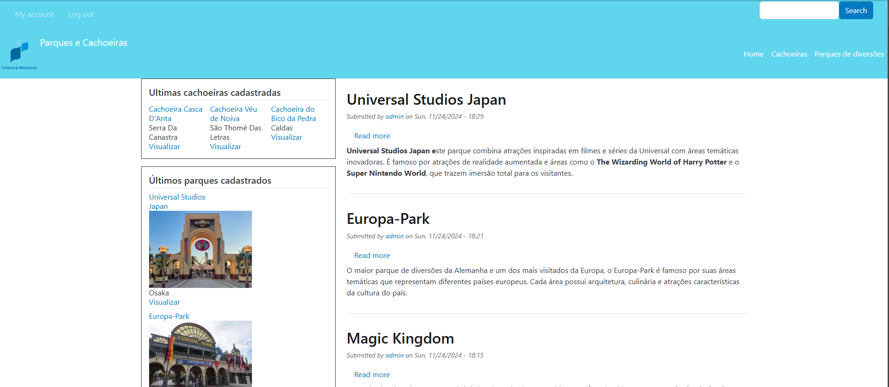

## SITE DRUPAL PARA O BOOTCAMP SQUADRA

Para rodar o projeto na sua maquina, voce devera ter o [Docker](https://docs.docker.com/engine/install/) e o [Lando](https://docs.lando.dev/getting-started/) instalados.



Va até a pasta raiz do projeto, e digite:

```bash
lando start
```

Em seguida, importe o arquivo de banco de dados (database.sql.gz) localizado na raiz do projeto, e rode o seguinte comando:

```bash
lando db-import database.sql.gz
```

Após isso, execute o seguinte comando para rodar as importações de configuração, localizadas em "web/config/sync":

```bash
lando drush cim
```


