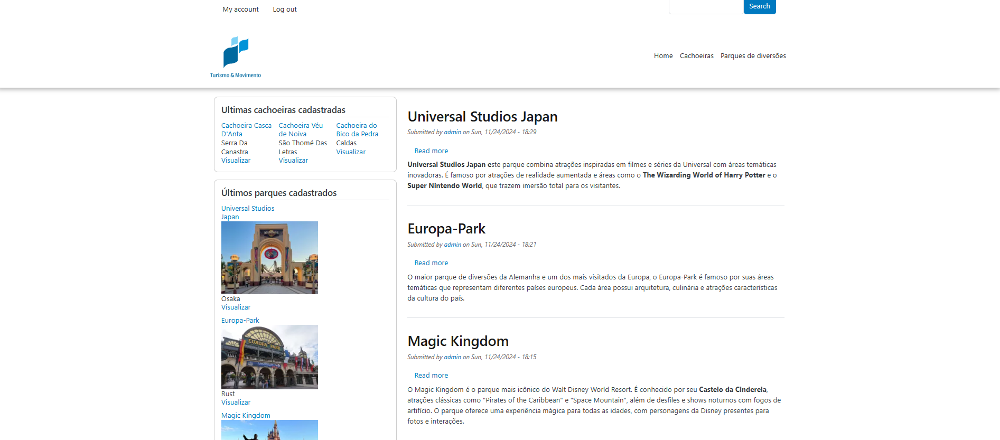

## SITE DRUPAL PARA O BOOTCAMP SQUADRA

Para rodar o projeto na sua maquina, voce devera ter o [Docker](https://docs.docker.com/engine/install/) e o [Lando](https://docs.lando.dev/getting-started/) instalados.



Va até a pasta raiz do projeto, e digite:

```bash
lando start
```

Instale as dependencias do projeto:

```bash
lando composer install
```

Em settings.php, adicione o seguinte codigo ao final do arquivo:

```php
$databases['default']['default'] = array (
  'database' => 'drupal10',
  'username' => 'drupal10',
  'password' => 'drupal10',
  'prefix' => '',
  'host' => 'database',
  'port' => '',
  'isolation_level' => 'READ COMMITTED',
  'driver' => 'mysql',
  'namespace' => 'Drupal\\mysql\\Driver\\Database\\mysql',
  'autoload' => 'core/modules/mysql/src/Driver/Database/mysql/',
);
$settings['config_sync_directory'] = 'config/sync';
```

Em seguida, importe o arquivo de banco de dados (database.sql.gz) localizado na raiz do projeto, e rode o seguinte comando:

```bash
lando db-import database.sql.gz
```

Após isso, execute o seguinte comando para rodar as importações de configuração, localizadas em "web/config/sync":

```bash
lando drush cim
```

Caso o comando lando drush cr não esteja funcionando, em settings.php adicione uma string ao hash_salt:

```php
$settings['hash_salt'] = 'CHANGE_THIS';
```

Saida da view para o json:  https://my-lando-app.lndo.site/json-output

